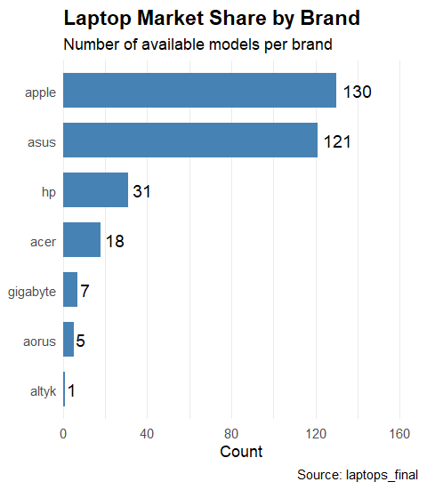
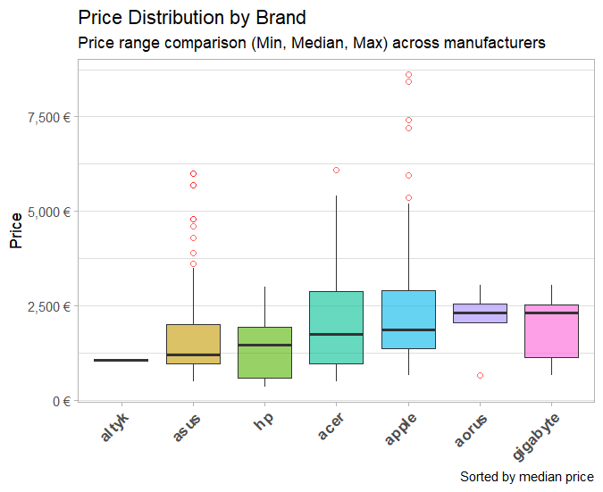
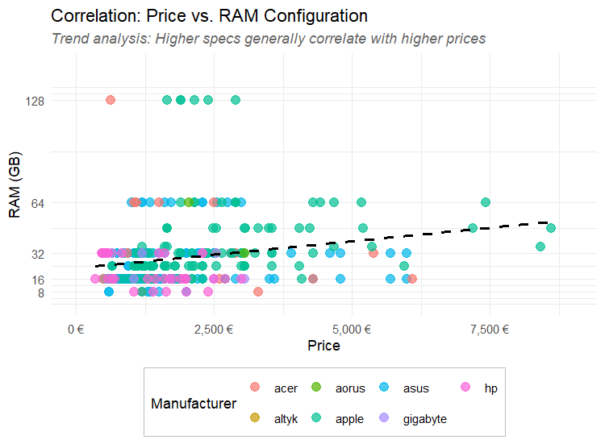

# Laptop Price Intelligence

# Overview

Laptop Price Intelligence is an end-to-end data engineering and analysis project aimed at understanding the laptop market in France. The project involves building an automated ETL pipeline to scrape real-time pricing data from Materiel.net, cleaning and processing complex specifications using Regex, and performing exploratory data analysis (EDA) to reveal market trends.

This project demonstrates a "Full-stack Data" approach, utilizing Python for backend engineering and R for advanced statistical visualization.

# Key Insights & Visualizations

1. Market Share by Brand
Asus dominates the inventory, followed by Apple and HP. This suggests a high demand for varied consumer electronics and premium devices.

---
2. Price Segmentation
Apple consistently occupies the premium segment with the highest median price, while Acer and HP cater to the budget-friendly market.

---
3. Price vs. Configuration (RAM)
There is a strong positive correlation between RAM and Price. 16GB has become the market standard.

---
# Usage

1. Run Scraping: python src/01_web_scraping.py

2. Clean Data: python src/02_data_cleaning.py

3. Extract Features: python src/03_feature_engineering.py

4. Visualize: Open src/04_data_analysis_en_R.R in RStudio and run the script.

# Future Improvements

+ Implement a SQL database (PostgreSQL) for data storage.
+ Build a Price Prediction Model using Linear Regression.
+ Create an interactive Dashboard using Streamlit.

# Author
Nhat Hoang BUI
